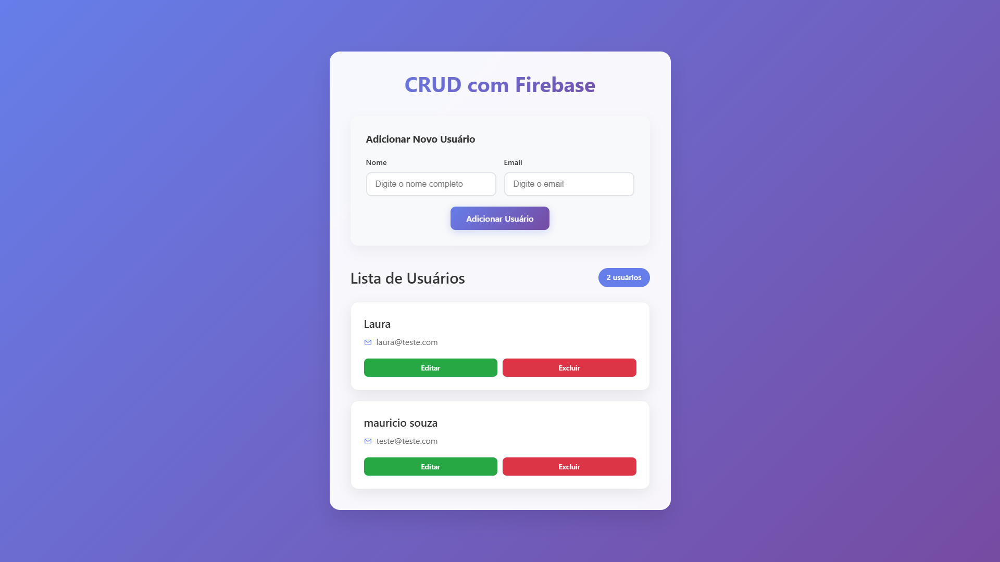

# CRUD com React e Firebase

Este projeto é uma aplicação CRUD (Create, Read, Update, Delete) desenvolvida com React e Firebase Realtime Database. A aplicação permite gerenciar usuários, oferecendo funcionalidades para adicionar, listar, atualizar e excluir registros em tempo real.

## 🚀 Funcionalidades

- ✅ **Criar**: Adicionar novos usuários com nome e e-mail
- 📖 **Ler**: Listar todos os usuários cadastrados
- ✏️ **Atualizar**: Modificar informações de usuários existentes
- 🗑️ **Excluir**: Remover usuários do banco de dados
- 🔄 **Tempo Real**: Sincronização automática com Firebase

## 🛠️ Tecnologias Utilizadas

- [React](https://react.dev/) - Biblioteca para construção da interface
- [Vite](https://vitejs.dev/) - Build tool e dev server
- [Firebase](https://firebase.google.com/) - Backend as a Service (Realtime Database)
- [ESLint](https://eslint.org/) - Linting para qualidade do código

## 📁 Estrutura do Projeto

```bash
CRUD-FireBase/
├── public/
│   └── vite.svg
├── src/
│   ├── assets/
│   │   └── react.svg
│   ├── App.css
│   ├── App.jsx
│   ├── firebase.js
│   ├── index.css
│   └── main.jsx
├── .env
├── .gitignore
├── bun.lock
├── eslint.config.js
├── index.html
├── package.json
├── README.md
└── vite.config.js
```

## 🔧 Configuração do Ambiente

1. **Clone o repositório**
   ```bash
   git clone https://github.com/MR1C10/CRUD-FireBase.git
   cd CRUD-FireBase
   ```

2. **Instale as dependências**
   ```bash
   npm install
   ```

3. **Configure as variáveis de ambiente**
   - Crie um arquivo `.env` na raiz do projeto
   - Adicione suas credenciais do Firebase:
   ```env
   VITE_FIREBASE_API_KEY=sua_api_key
   VITE_FIREBASE_AUTH_DOMAIN=seu_auth_domain
   VITE_FIREBASE_DATABASE_URL=sua_database_url
   VITE_FIREBASE_PROJECT_ID=seu_project_id
   VITE_FIREBASE_STORAGE_BUCKET=seu_storage_bucket
   VITE_FIREBASE_MESSAGING_SENDER_ID=seu_messaging_sender_id
   VITE_FIREBASE_APP_ID=seu_app_id
   ```

4. **Inicie o servidor de desenvolvimento**
   ```bash
   npm run dev
   ```

5. **Acesse a aplicação**
   - Abra seu navegador em `http://localhost:5173`

---